# RediSetCode

A thesis project in College which gamify the learning of Programming for beginners.

## Screenshots

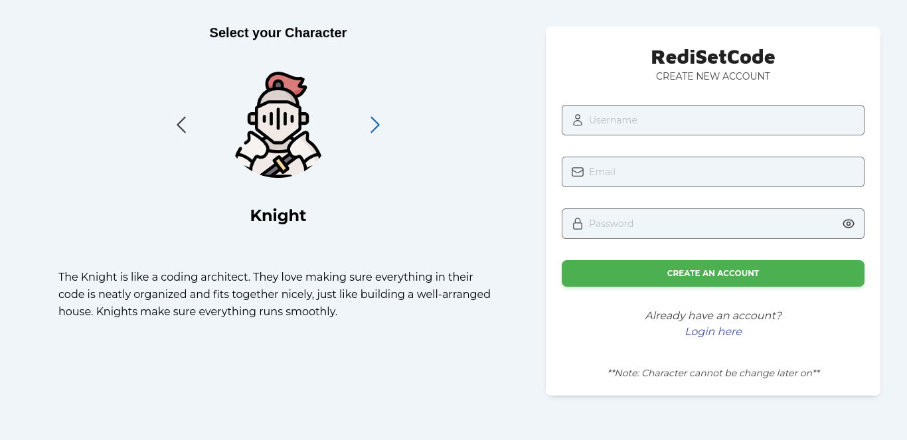
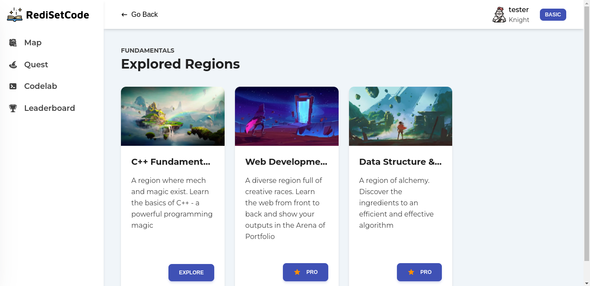
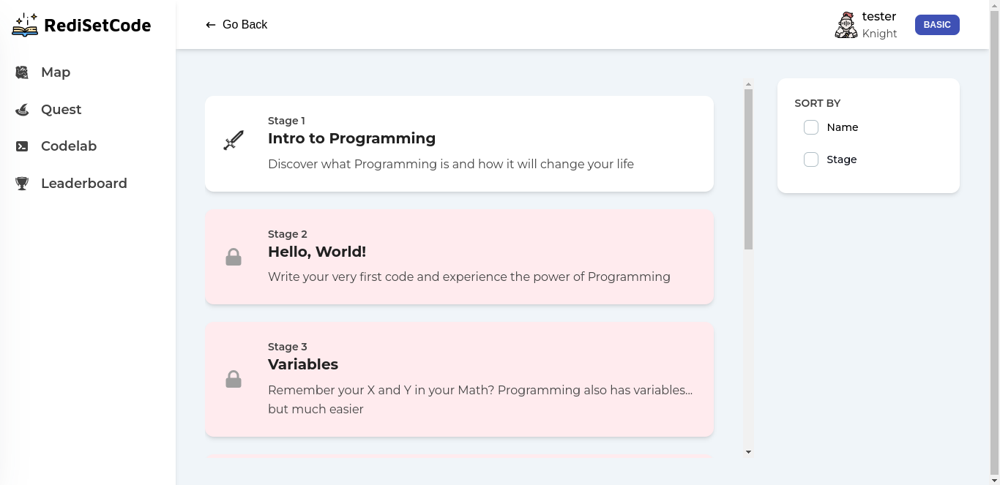
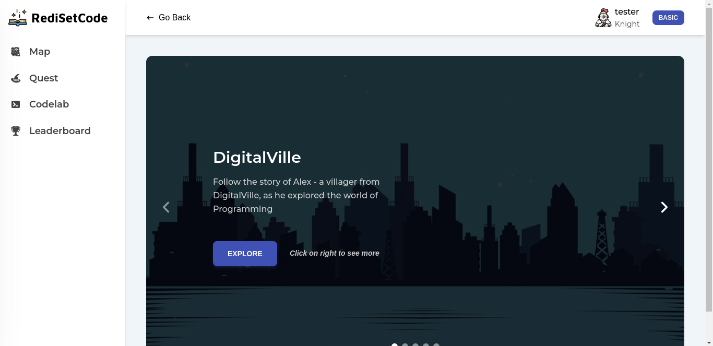
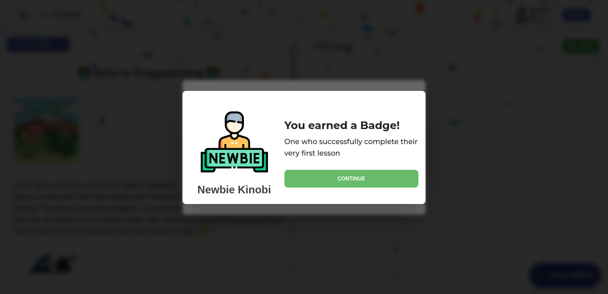
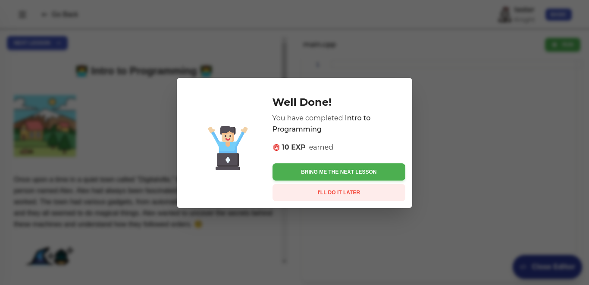
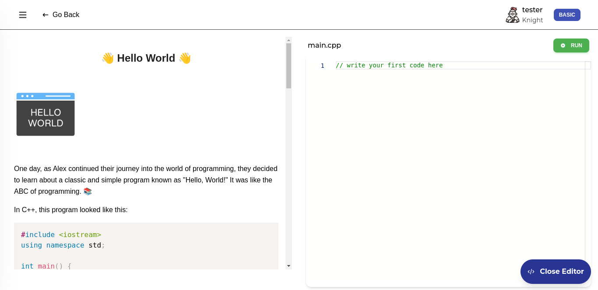
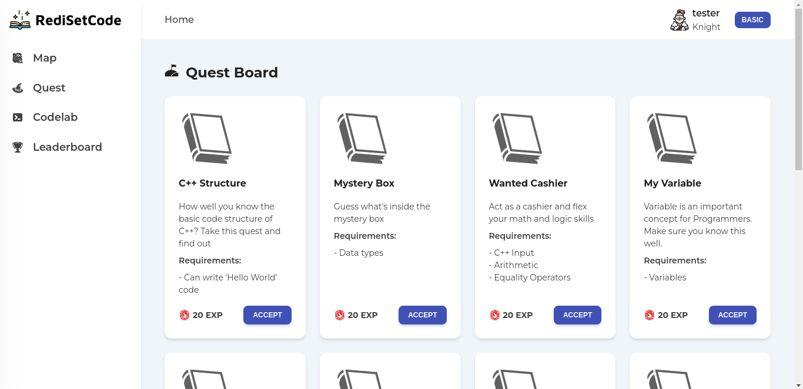
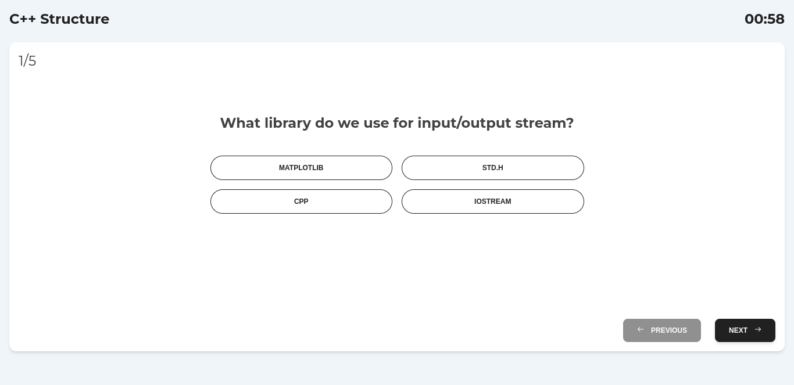
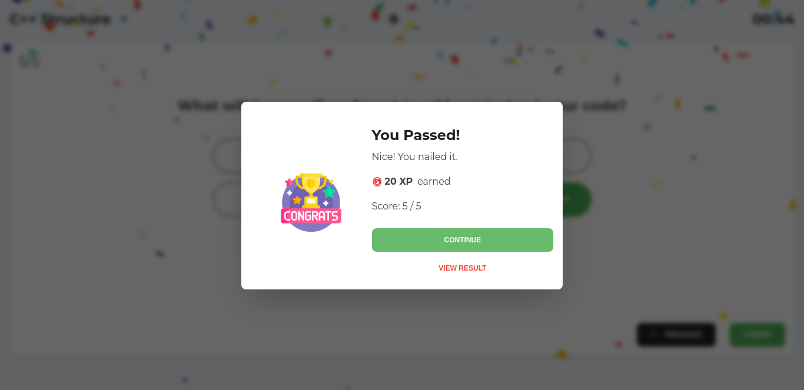
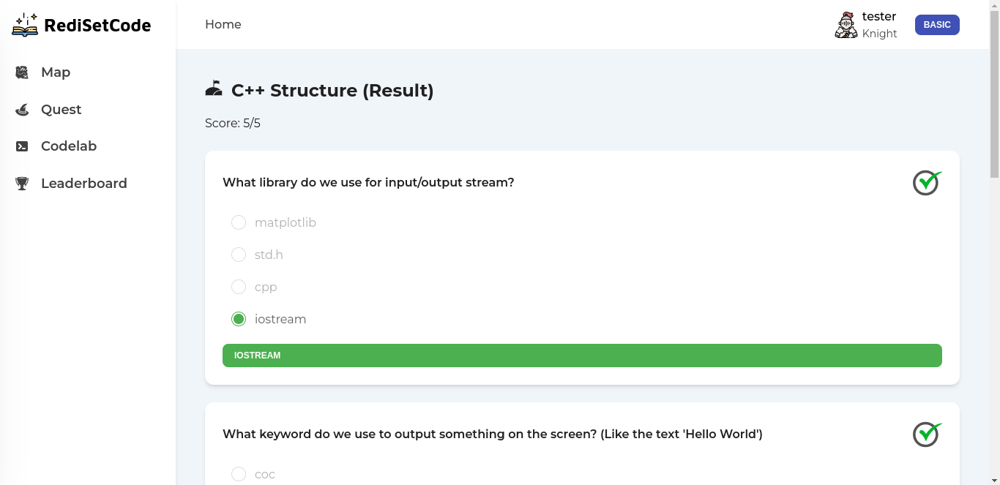
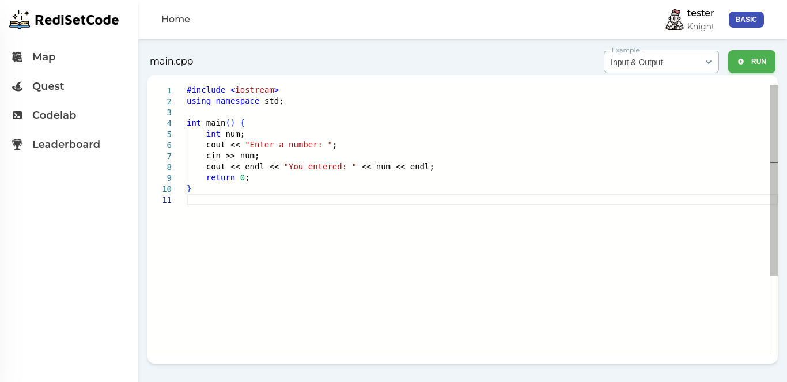
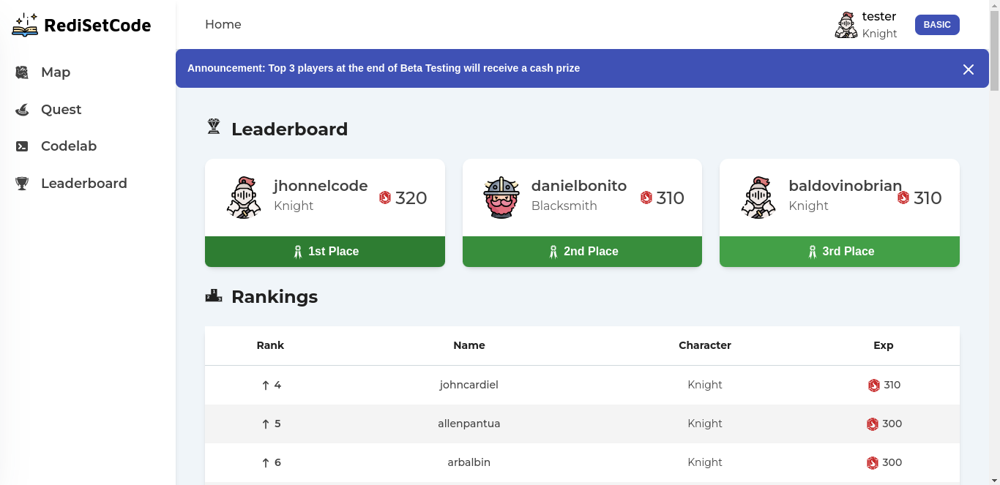
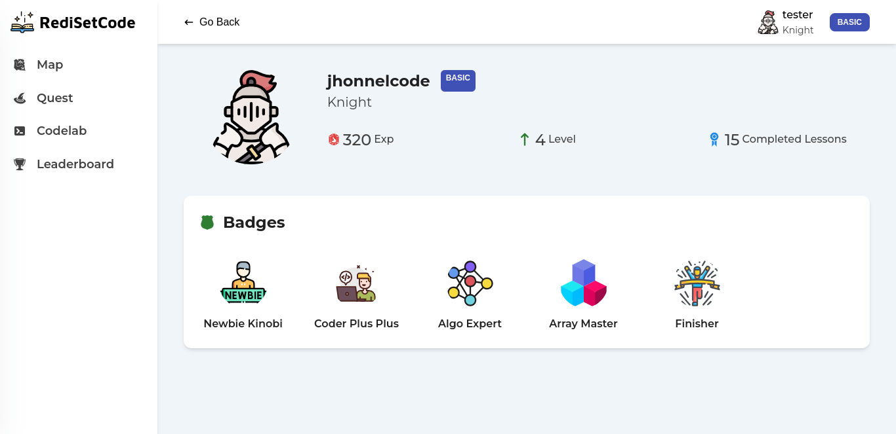

## Features

- REST API
- Code Editor
- Language Compiler
- app-specific features are showed in the screenshot

## Lessons Learned

After my raffle app project, all projects I made are monolithic app. Here in my thesis, I decided to separate my frontend to backend and use API (because its popular LOL!). Upon using this kind of approach, I became amazed on how clear and organize it is to follow this API thing (will definitely follow this approach on my succeeding projects).

So here's what I learned in this project: REST API and how it works and communicate (I learned CORS hihi)), the different HTTP code and methods. I used Postman and document my api routes with it. Tried this new NoSQL concept with MongoDB. Experience a powerful frontend tool - React and its hooks (I used useEffect and useState a lot), and many more.

What became a challenge for me in this project is the folder structure and lots of boilerplate code. Nodejs with Express is really quite different from frameworks I used to (Django, Laravel). All the things is up to me to decided - folder structure, route handling, validation, etc. However, this is a hidden gem for me as I really delve deeper and trully understand how frameworks work. Regarding the structure, I used MVC in a component-based as I really like separation of concerns and fond of Django which uses this kind of architecture. The boilerplate problem solved with user snippets in vs code.

## Tech Stack

**Client:** JS/Vite/React, Tailwind/Material Tailwind

**Server:** Nodejs/Express, MongoDB/Mongoose

## Appendix

This codebase is the prototype version of RediSetCode. You may see a "bad code" or bad practices in this codebase but it is intentionally leave at it is by the developer. The purpose of this codebase is for project showcase. Original codebase is not open source as this project is a Startup project.
